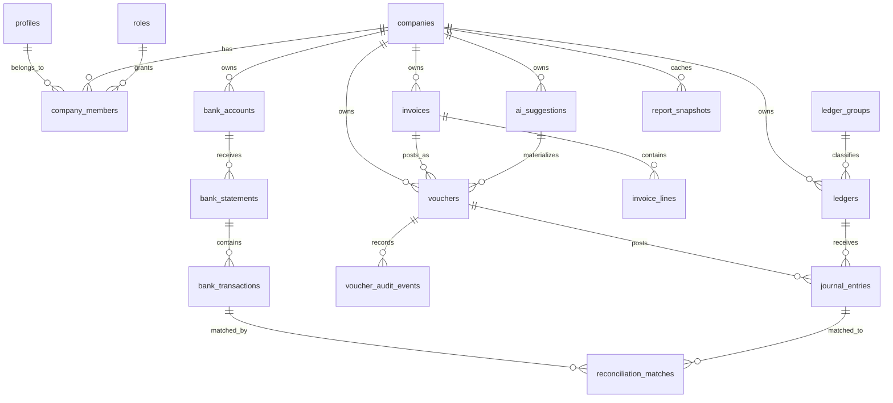

# ABHAY Accounting OS by ANVRITAI

Phase 0: Complete Architecture and Database

## Product Boundary

ABHAY Accounting OS is an AI-first accounting, finance, taxation, GST, ledger, reconciliation, and reporting system for Indian MSMEs, traders, manufacturers, retailers, startups, CAs, and accounting firms.

It intentionally excludes CRM, HR, broad ERP, project management, and non-accounting business-suite features.

## Core Operating Model

Traditional accounting software asks the user to create accounting records manually.

ABHAY Accounting OS asks the user to state or upload what happened, then ABHAY AI creates accounting candidates. The user verifies, approves, edits, or rejects them. Approved entries post instantly into the double-entry ledger and refresh financial statements in real time.

## Complete Folder Structure

```text
abhay-accounting-os/
  apps/
    web/
      app/
        (auth)/
          login/
          signup/
        (app)/
          dashboard/
          companies/
          ledgers/
          vouchers/
          invoices/
          banking/
          reports/
          ai/
        api/
      components/
        accounting/
        ai/
        auth/
        layout/
        reports/
        ui/
      lib/
        api/
        auth/
        config/
        format/
        validation/
      styles/
      tests/
      next.config.mjs
      package.json
      tailwind.config.ts
      tsconfig.json
    api/
      app/
        api/
          routes/
            auth.py
            companies.py
            ledgers.py
            vouchers.py
            invoices.py
            banking.py
            reports.py
            ai.py
        core/
          config.py
          database.py
          security.py
        domain/
          accounting/
            chart_of_accounts.py
            double_entry.py
            financial_statements.py
            gst.py
            vouchers.py
          ai/
            classifier.py
            copilot.py
            prompts.py
            validators.py
          banking/
            reconciliation.py
          invoices/
            numbering.py
            pdf.py
        models/
        schemas/
        services/
        tests/
      alembic/
        versions/
      pyproject.toml
  packages/
    config/
    types/
  supabase/
    migrations/
      0001_initial_accounting_schema.sql
    policies/
      rls_policies.sql
  infra/
    docker/
      api.Dockerfile
      web.Dockerfile
    compose.yaml
    env.example
  docs/
    architecture.md
    database.md
    ai-architecture.md
    api.md
    deployment.md
  README.md
```

## Backend Architecture

The backend is a FastAPI service built around strict domain boundaries:

- `core`: configuration, database sessions, security helpers, request context.
- `domain/accounting`: double-entry posting engine, voucher validation, report generation, GST rules, chart of accounts.
- `domain/invoices`: GST invoice numbering, invoice posting, PDF generation.
- `domain/banking`: statement import, deterministic matching, AI-assisted reconciliation.
- `domain/ai`: ABHAY AI prompt contracts, structured JSON outputs, risk scoring, guardrails, approval workflow.
- `routes`: thin HTTP controllers. Routes do not contain accounting logic.
- `services`: orchestration across domains, permissions, persistence.

Every accounting write runs through the posting service. Raw journal inserts are not exposed to clients. Each voucher must balance before approval and posting.

## Frontend Architecture

The frontend is a Next.js TypeScript app with TailwindCSS and Shadcn UI.

Primary surfaces:

- Auth: login, signup, company selection.
- Dashboard: real-time revenue, expenses, profit, cash, receivables, payables, GST liability.
- Ledgers: chart of accounts, ledger detail, ledger statement.
- Vouchers: journal, receipt, payment, contra, sales, purchase, debit note, credit note.
- Invoices: sales invoice, purchase invoice, GST invoice, PDF action.
- Banking: statement upload, matching, reconciliation queue.
- Reports: P&L, balance sheet, cash flow, trial balance, GST reports.
- ABHAY AI: natural language and voice accounting assistant with approval queue.

State strategy:

- Server state through typed API clients.
- Supabase Auth session as the identity source.
- Company context required for every protected route.
- Optimistic UI only for draft objects; posted accounting entries wait for backend confirmation.

## Authentication System

Supabase Auth owns identities. The application database stores authorization and company membership:

- `profiles`: one application profile per Supabase user.
- `companies`: accounting tenant.
- `company_members`: role mapping between users and companies.
- `roles` and `role_permissions`: application-level authorization.

Protected APIs require:

1. A valid Supabase JWT.
2. A selected `company_id`.
3. Active membership in that company.
4. Permission for the requested accounting action.

Roles:

- Owner: all permissions for a company.
- Admin: full accounting operations except ownership transfer.
- Accountant: ledgers, vouchers, reports, invoices, banking, AI approvals.
- Auditor: read-only reports and ledgers.
- Staff: limited voucher and invoice drafts.

## Database Design Principles

- Multi-tenant isolation through `company_id` on all accounting records.
- Double-entry ledger as the immutable source of truth.
- Drafts and AI suggestions are separate from posted ledger entries.
- Posted vouchers are append-only; reversals create new vouchers.
- All money is stored as `numeric(18,2)`.
- GST is modeled explicitly, not as free text.
- Reports are computed from posted journal lines and optionally cached.
- Row level security is enabled for tenant-owned tables.

## ER Diagram



## API Endpoints

Authentication and tenant context:

- `POST /auth/session/verify`
- `GET /me`
- `GET /companies`
- `POST /companies`
- `PATCH /companies/{company_id}`
- `POST /companies/{company_id}/members`
- `PATCH /companies/{company_id}/members/{member_id}`

Ledgers:

- `GET /companies/{company_id}/ledgers`
- `POST /companies/{company_id}/ledgers`
- `GET /companies/{company_id}/ledgers/{ledger_id}`
- `PATCH /companies/{company_id}/ledgers/{ledger_id}`
- `GET /companies/{company_id}/ledgers/{ledger_id}/statement`

Vouchers and journal posting:

- `GET /companies/{company_id}/vouchers`
- `POST /companies/{company_id}/vouchers/draft`
- `POST /companies/{company_id}/vouchers/{voucher_id}/approve`
- `POST /companies/{company_id}/vouchers/{voucher_id}/reverse`
- `GET /companies/{company_id}/vouchers/{voucher_id}`
- `GET /companies/{company_id}/trial-balance`

Invoices:

- `GET /companies/{company_id}/invoices`
- `POST /companies/{company_id}/invoices`
- `GET /companies/{company_id}/invoices/{invoice_id}`
- `POST /companies/{company_id}/invoices/{invoice_id}/post`
- `GET /companies/{company_id}/invoices/{invoice_id}/pdf`

Bank reconciliation:

- `POST /companies/{company_id}/bank-accounts`
- `POST /companies/{company_id}/bank-statements`
- `GET /companies/{company_id}/bank-transactions`
- `POST /companies/{company_id}/bank-transactions/{transaction_id}/match`
- `POST /companies/{company_id}/bank-transactions/{transaction_id}/ai-reconcile`

Reports:

- `GET /companies/{company_id}/reports/dashboard`
- `GET /companies/{company_id}/reports/profit-and-loss`
- `GET /companies/{company_id}/reports/balance-sheet`
- `GET /companies/{company_id}/reports/cash-flow`
- `GET /companies/{company_id}/reports/gst`
- `GET /companies/{company_id}/reports/receivables`
- `GET /companies/{company_id}/reports/payables`

ABHAY AI:

- `POST /companies/{company_id}/ai/accounting-command`
- `POST /companies/{company_id}/ai/voice-command`
- `GET /companies/{company_id}/ai/suggestions`
- `POST /companies/{company_id}/ai/suggestions/{suggestion_id}/approve`
- `POST /companies/{company_id}/ai/suggestions/{suggestion_id}/reject`
- `GET /companies/{company_id}/ai/cfo-insights`

## AI Architecture

ABHAY AI uses a structured accounting pipeline:

1. Input normalization: English, Hindi, or Hinglish text is normalized while preserving amounts, dates, party names, GST hints, and payment mode.
2. Intent classification: expense, income, purchase, sale, payment, receipt, transfer, adjustment, reconciliation, or report question.
3. Entity extraction: amount, currency, date, ledger candidates, tax rate, GST treatment, counterparty, payment source.
4. Voucher proposal: model returns strict JSON for a draft voucher.
5. Deterministic validation: backend verifies double-entry balance, company scope, ledger existence, GST rules, date period status, duplicate risk, and missing data.
6. Confidence scoring: low-confidence proposals require review; high-confidence proposals still require approval for Phase 1.
7. Posting: only approved suggestions become posted vouchers and journal entries.
8. Feedback loop: corrections are stored as accounting training examples for company-specific preferences.

Guardrails:

- The model never directly writes posted journal entries.
- All AI outputs are schema-validated.
- Ledger suggestions are constrained to the company chart of accounts.
- GST classification is validated against supply type, registration status, place of supply, and tax rate.
- Anomaly detection compares entries against historical ledgers, duplicate invoices, unusual amounts, and bank activity.

## Real-Time Profit Intelligence

Every posted voucher updates the financial position because reports are calculated from journal entries:

- Revenue: credit balances in income ledgers.
- Expenses: debit balances in expense ledgers.
- Profit: revenue minus expenses.
- Cash position: balances of cash and bank ledgers.
- Receivables: debit balances in sundry debtor ledgers.
- Payables: credit balances in sundry creditor ledgers.
- GST liability: output GST minus input GST plus reverse-charge adjustments.

For high traffic, the service maintains `report_snapshots` updated after each posting transaction. Snapshots are performance caches, not the source of truth.

## Deployment Guide

Local development:

1. Copy `infra/env.example` to `.env`.
2. Configure Supabase project URL, anon key, service role key, PostgreSQL URL, OpenAI API key, and public API URLs.
3. Start PostgreSQL-compatible Supabase locally or point to a Supabase cloud database.
4. Apply `supabase/migrations/0001_initial_accounting_schema.sql`.
5. Start the FastAPI service.
6. Start the Next.js web app.

Cloud deployment:

- Frontend: Vercel.
- Backend: Docker container on a cloud app platform.
- Database/Auth/Storage: Supabase.
- Background jobs: container worker using the same backend image with a worker entrypoint.

Production requirements:

- Enforce RLS on all tenant tables.
- Keep Supabase service role key only on the backend.
- Require HTTPS.
- Enable database backups and point-in-time recovery.
- Store invoice PDFs in Supabase Storage with company-scoped paths.
- Log AI prompt IDs, model version, structured output, validation result, and user approval action.

## Docker Configuration

The infrastructure folder contains:

- `infra/docker/api.Dockerfile` for FastAPI.
- `infra/docker/web.Dockerfile` for Next.js.
- `infra/compose.yaml` for local orchestration.
- `infra/env.example` for required environment variables.

## Phase Acceptance Criteria

Architecture and database are complete when:

- All Phase 1 MVP domains have tables or explicit computed-report rules.
- Company-level tenant isolation is present.
- Double-entry voucher posting can be represented without ambiguity.
- AI suggestions remain drafts until approval.
- GST, invoices, bank reconciliation, reports, and audit trails are modeled.
- The schema can be migrated in PostgreSQL/Supabase.

